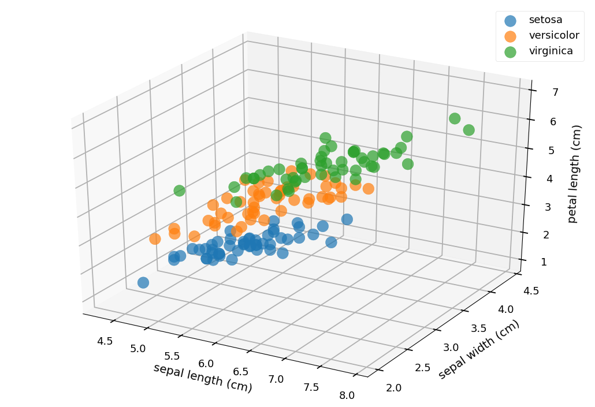
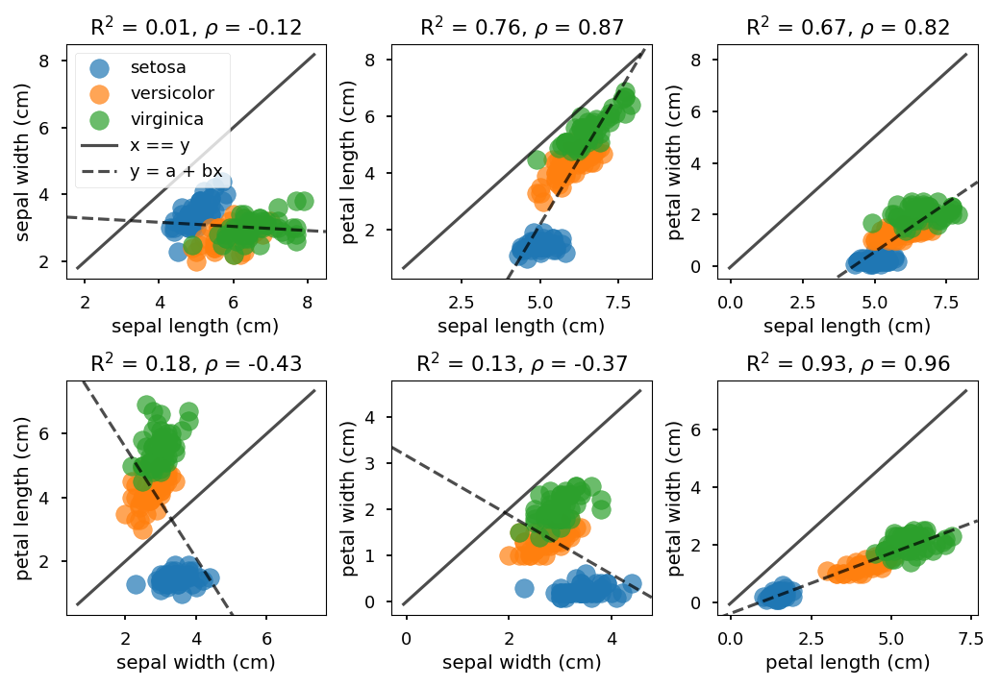
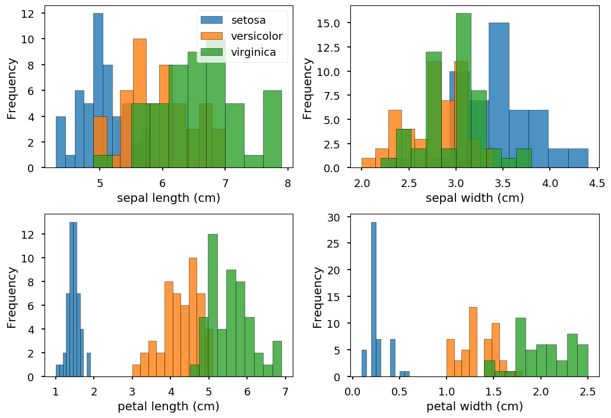

# psynlig

A library for creating plots with
[matplotlib](https://matplotlib.org/).


## Examples

### Generating a heat map for correlations

The following code
```python examples/heat_correlation/heat_correlation_readme.py
from matplotlib import pyplot as plt
import pandas as pd
from sklearn.datasets import load_iris
from psynlig import plot_heatmap
plt.style.use('seaborn-talk')


data_set = load_iris()
data = pd.DataFrame(data_set['data'], columns=data_set['feature_names'])
fig, _ = plot_heatmap(data, vmin=-1, vmax=1, textcolors=['white', 'black'])
fig.savefig('heatmap_example.png', bbox_inches='tight')
plt.show()
```

will generate a heat map for identifying correlations:


### Generating scatter plots for raw data

The following code
```python examples/scatter/scatter_readme_3d.py
from matplotlib import pyplot as plt
import pandas as pd
from sklearn.datasets import load_iris
from psynlig import plot_3d_scatter
plt.style.use('seaborn-talk')


data_set = load_iris()
data = pd.DataFrame(data_set['data'], columns=data_set['feature_names'])
class_data = data_set['target']
class_names = dict(enumerate(data_set['target_names']))
plot_3d_scatter(data, 'sepal length (cm)', 'sepal width (cm)',
                'petal length (cm)', class_names=class_names,
                class_data=class_data, marker='o', s=200, alpha=0.7)
plt.show()
```
will generate a 3D scatter plot of the selected variables:



And the following code
```python examples/scatter/scatter_readme_2d.py
from matplotlib import pyplot as plt
import pandas as pd
from sklearn.datasets import load_iris
from psynlig import generate_scatter
plt.style.use('seaborn-talk')


data_set = load_iris()
data = pd.DataFrame(data_set['data'], columns=data_set['feature_names'])
class_data = data_set['target']
class_names = dict(enumerate(data_set['target_names']))
variables = ['sepal length (cm)', 'sepal width (cm)',
             'petal length (cm)', 'petal width (cm)']
generate_scatter(data, variables, class_names=class_names,
                 class_data=class_data, marker='o', s=200, alpha=0.7)
plt.show()
```

will generate 2D scatter plots for combinations of the selected variables:


### Generating histograms

The following code
```python examples/histogram/histogram_readme.py
from matplotlib import pyplot as plt
import pandas as pd
from sklearn.datasets import load_iris
from psynlig import histograms
plt.style.use('seaborn-talk')


data_set = load_iris()
data = pd.DataFrame(data_set['data'], columns=data_set['feature_names'])
class_data = data_set['target']
class_names = dict(enumerate(data_set['target_names']))
variables = ['sepal length (cm)', 'sepal width (cm)',
             'petal length (cm)', 'petal width (cm)']
figs, _ = histograms(data, variables, class_names=class_names,
                     class_data=class_data, ncol=2, max_plots=4,
                     edgecolor='black', alpha=0.8)
figs[0].savefig('histogram.png', bbox_inches='tight')
plt.show()
```

will generate histograms for the selected variables:

