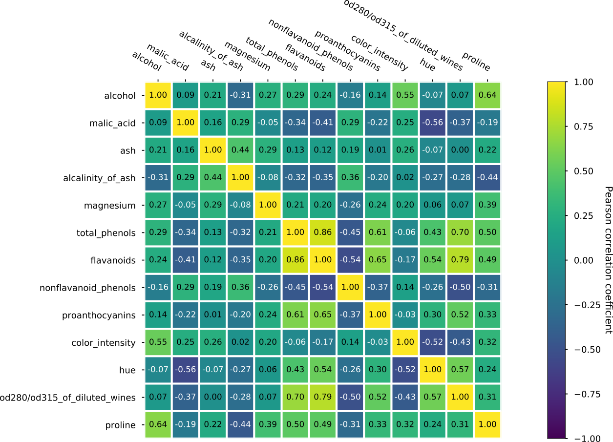

# psynlig

A library for creating plots with
[matplotlib](https://matplotlib.org/).
Please see
[https://psynlig.readthedocs.io/en/latest/](https://psynlig.readthedocs.io/en/latest/)
for the latest documentation.

